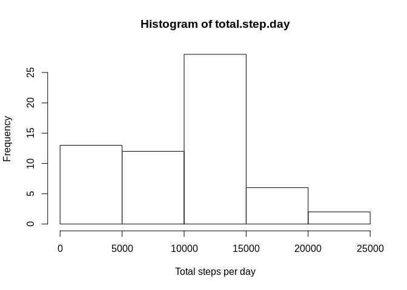
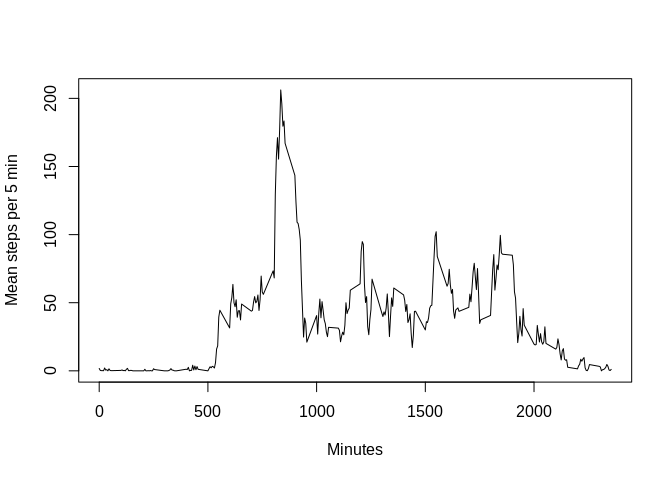
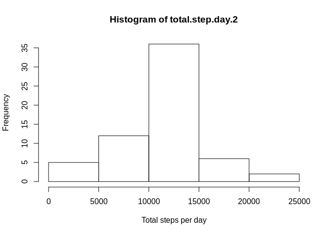

## Loading and preprocessing the data

```r
data <- read.csv("activity.csv")
total.step.day <- tapply(data$steps, data$date, sum, na.rm=TRUE)
hist(total.step.day, xlab="Total steps per day")
```

<!-- -->


## What is mean total number of steps taken per day?

```r
mean(total.step.day, na.rm=TRUE)
```

```
## [1] 9354.23
```

```r
median(total.step.day, na.rm=TRUE)
```

```
## [1] 10395
```

## What is the average daily activity pattern?

```r
mean.int.5 <- tapply(data$steps, data$interval, mean, na.rm=TRUE)
plot(mean.int.5 ~ unique(data$interval), type="l",
     xlab="Minutes", ylab="Mean steps per 5 min")
```

<!-- -->


The interval with the highest average number of steps:

```r
names(mean.int.5)[mean.int.5 == max(mean.int.5)]
```

```
## [1] "835"
```


## Imputing missing values
Number of missing values in the dataset:

```r
summary(is.na(data$steps))[3]
```

```
## TRUE 
## 2304
```
Imputation of missing data with mean values by 5 min interval

```r
        # Calculate mean steps per interval
mean.steps.int <- tapply(data$steps, data$interval, mean, na.rm=TRUE)
names(mean.steps.int) <- unique(data$interval)
        # Replace NA with mean for corresponding interval
steps.imput <- apply(data[,c(1,3)], 1, function(x){
        if (is.na(x[1])) mean.steps.int[names(mean.steps.int)==x[2]]
        else x[1]
})
        # Make datasets with imputed NAs
data.imput <- data ; data.imput$steps <- steps.imput
```

```r
total.step.day.2 <- tapply(data.imput$steps, data.imput$date, sum)
hist(total.step.day.2, xlab="Total steps per day")
```

<!-- -->

```r
mean(total.step.day.2)
```

```
## [1] 10766.19
```

```r
median(total.step.day.2)
```

```
## [1] 10766.19
```

## Are there differences in activity patterns between weekdays and weekends?


```r
data.imput$weekdays <- weekdays(as.Date(data.imput$date))
attach(data.imput)
par(mfrow=c(2,4))
for (day in unique(weekdays)) {
        mean.int.5 <- tapply(steps[weekdays==day], 
                             interval[weekdays==day], 
                             mean, na.rm=TRUE)
        plot(mean.int.5 ~ unique(interval), type="l", main=day,
             xlab="Minutes", ylab="Mean steps per 5 min")   
}
detach(data.imput)
```

<!-- -->
